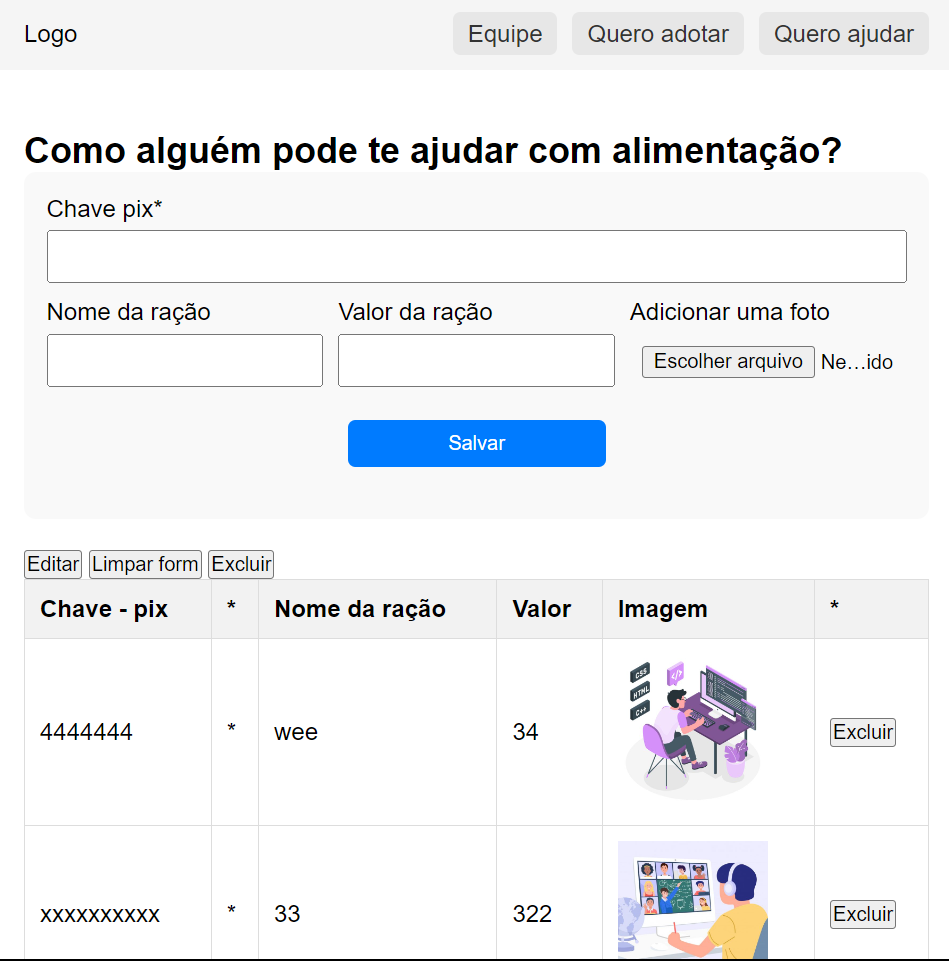

# Projeto Doação de Alimentos (Modelo salvando em localstorage)

## Sobre o Projeto
Este projeto visa facilitar a coleta de doações para organizações ou indivíduos que precisam de ajuda na alimentação. Ele oferece uma plataforma onde doadores podem selecionar itens alimentares para doar e realizar a doação através de PIX, uma forma de pagamento instantâneo muito utilizada.

## Funcionalidades

- **Selecionar Alimentos:** Usuários podem escolher diferentes tipos de alimentos para doar, especificando a quantidade e o valor que desejam contribuir.
- **Cadastro de Doação:** Ao escolher os itens para doar, os usuários inserem suas informações de pagamento PIX, e uma imagem do item é carregada para facilitar a identificação.
- **Salvamento de Doações:** Todas as doações são salvas localmente no navegador do usuário usando `localStorage`, com imagens convertidas em formato Base64.
- **Edição e Exclusão:** Os usuários podem editar clicando diretamente nas células semelhante ao excel, ou excluir doações clicando no botão excluir.

## Administração

- **Gerenciamento de Doações:** Um sistema de gerenciamento de doações permite visualizar todas as contribuições realizadas, editar detalhes, ou excluir doações inapropriadas.

## Integração com PIX

- **Geração de QR Code:** Para cada doação, um QR Code do PIX é gerado automaticamente, permitindo aos usuários realizar pagamentos de forma rápida e segura.

## Como Funciona

1. **Início da Doação:** Usuários iniciam o processo de doação escolhendo alimentos da lista disponível e informando o valor que pretendem doar.
2. **Cadastro de Informações:** As informações da doação são inseridas, incluindo a chave PIX para pagamento.
3. **Confirmação e Salvamento:** Após a confirmação, os detalhes da doação são salvos no `localStorage`.
4. **Gerenciamento:** Os administradores podem acessar a lista de doações, editar informações ou excluir registros.

## Tecnologias Utilizadas

- HTML5
- CSS3
- JavaScript ES6
- `localStorage` para armazenamento de dados
- FileReader API para manipulação de imagens

## Configuração e Execução

### Pré-requisitos

- Navegador moderno com suporte a JavaScript e HTML5.

### Execução Local

1. Clone o repositório para sua máquina local.
2. Abra o arquivo `index.html` no navegador para iniciar a aplicação.
3. Para gerenciar as doações, acesse  `doacoes.html`.

## Contribuições

Contribuições são sempre bem-vindas! Para contribuir, por favor, siga estes passos:

1. **Fork** o repositório.
2. **Crie** uma nova branch: `git checkout -b nova-feature`.
3. **Commit** suas mudanças: `git commit -m 'Adicionando uma nova feature'`.
4. **Push** para a branch: `git push origin nova-feature`.
5. Abra um **Pull Request**.

## Licença

Distribuído sob a licença MIT. Veja `LICENSE` para mais informações.

## Contato

- **Nome do Responsável** - [@faustinopsy](https://github.com/faustinopsy)
- **linkedin** - https://www.linkedin.com/in/faustinopsy/
- **Projeto Link** - [Projeto Doação de Alimentos](https://github.com/faustinopsy/doacoes)

---

